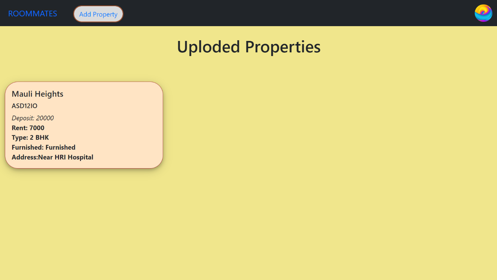

# ROOMMATES

 

&nbsp;
## INTRODUCTION TO THE SYSTEM

Website for PG properties and flats for students and working
professionals is the website which provides accessibility to students as
well as working professionals to search and rent properties according to
their requirements. This system can be used to search, sort, filter and
rent properties according to the user requirements.

&nbsp;
### Problem Definition
Renting a new property in a new place is a bewildering task for any
individual, especially a student or a working professional. Lack of
proper property information and location, communication barrier between
a tenant and owner, broker lobby in particular area becomes a hurdle in
the way of individual. Even rent and deposit payment scheme still comes
in an offline mode which still is a snag in the way of payment system.

&nbsp;
### Scope of System
The contemporary system is designed to overcome previously stated
problems and relieve both tenant as well as owner in its own ways. The
tenant (student or working professional) can easily search and rent
property according to their requirements. The user can sort property
according to his/her needs so as to smoothen renting process. Also, the
payment system will be available through the website to ease payment
accessibility between tenant and owner.

&nbsp;
### _*Advantages*_
-   A specialized property renting website only for students and working
    professionals.
-   Proper communication between tenant and owner without any
    third-party interruptions.
-   Sorting and Filters according to user requirement to get required
    property information without any delay.

### _*Disadvantages*_
-   Internet connection is required.

&nbsp;
## SYSTEM ANALYSIS
### Requirement Analysis
Requirement analysis involved defining customer needs and objectives in
the context of planned customer use, environments and identified system
characteristics to determine requirements for system functions.

&nbsp;
### Functional Requirements
This is a necessary task, action or activity that was accomplished. The
proposed system can:
-   Allow the administrator to delete houses, tenants and defaulters
    details.
-   Allow the administrator to search for data in the database.
-   Allow the administrator to edit data in the database.

&nbsp;
#### Actor Function

&nbsp;
_*Owner*_
-   Adding information about the house

&nbsp;
_*Tenant*_
-   Search the house.
-   Select the house they want.
-   Rent the house.

&nbsp;
_*Administrator*_
-   Edit data in the database.
-   Delete data in the database.
-   Update data in the database
-   Delete tenant and owner.

&nbsp;
### Performance requirements
The system should respond within a short period of time. It depends on
the performance of the hardware environment such as RAM and
processor

&nbsp;
### Feasibility Study of the System
The feasibility study is the preliminary study that determines whether a
proposed system project is financially, technically and operationally.
Feasibility study is essential to evaluate the cost and benefits of the new system.
The alternative analysis usually includes as part of the feasibility study, identifies viable alternatives for the system design and development.

&nbsp;
### Operational Feasibility
The system to be developed will provide accurate, active, secured service and decreases labour of workers and also it is not limited to particular groups or body. The system will easily operational, as it doesn't affect the existing organizational structure and support the current system. So the system will be operationally feasible.

&nbsp;
### Technical Feasibility
The system to be developed by using technologically system development techniques such as PHP, Java script, CSS and PostgreSQL database without any problems and the group members have enough capability to develop the project. Our focus is to develop well organized dynamic web site that is technically efficient and effective for managing the Online Trade interaction system. Therefore, it can be concluding that the system is technically feasible.

&nbsp;
### Economic Feasibility
The system to be developed is economically feasible and the benefit is outweighing the cost. Since this project already computerizes the existing system and more advanced than the current system reduces and change the labour force to computerize system. Reduces the cost of the material used.

&nbsp;
### **Hardware and Software Requirements:**
#### H/W Configuration (Server Side)
- Processor - Core i3 & above
- Speed - 2 GHz & above
- RAM - 2 GB & above
- Hard Disk - 500 GB & above

#### Software (Server Side)
- Operating System − Linux (Debian or Red Hat Based)
- Server − Apache 2.4.X
- Database − PostgreSQL

#### H/W Configuration (Client Side)
- Processor − Pentium 4 or above
- Speed - 1.1 GHz & above
- RAM - 1 GB & above
- Hard Disk - 5 GB or above

#### Software (Client Side) Technology
- Operating System − Windows 7,8,10, Linux.
- Web Browser − Google Chrome, Mozilla Firefox etc.

&nbsp;
### ER Diagram
&nbsp;

&nbsp;
### Data Dictionary

#### Admin

|     **Attribute**    |     **Data type**    |     **Constraints**    |
|------------------|--------------------|--------------------|
|     username     |     text           |     not null     |
|     password     |     text           |                    |

&nbsp;
#### Owner

|     **Attribute**    |              **Data type**             |     **Constraints**    |
|:----------------:|:----------------------------------:|:------------------:|
|      login_id    |               integer              |       Not null     |
|        name      |                 text               |                    |
|       gender     |         Character varying(8)       |                    |
|        dob       |                 date               |                    |
|       ph_no      |                bigint              |                    |
|       email      |                 text               |                    |
|      username    |                 text               |       Not null     |
|      password    |          character varying         |                    |
|       status     |         character varying(9)       |                    |
|       image      |                 text               |                    |
|      Reg_time    |     Timestamp without time zone    |                    |

&nbsp;
#### Tenant

|     **Attribute**    |              **Data type**             |     **Constraints**    |
|:----------------:|:----------------------------------:|:------------------:|
|      login_id    |               integer              |       Not null     |
|        name      |                 text               |                    |
|       gender     |         Character varying(8)       |                    |
|        dob       |                 date               |                    |
|       ph_no      |                bigint              |                    |
|       email      |                 text               |                    |
|      username    |                 text               |       Not null     |
|      password    |          character varying         |                    |
|       status     |         character varying(9)       |                    |
|       image      |                 text               |                    |
|      Reg_time    |     Timestamp without time zone    |                    |

&nbsp;
#### Property

|      **Attribute**     |              **Data type**             |     **Constraints**    |
|:------------------:|:------------------------------------:|:------------------:|
|         p_id       |                  text                |      Not null    |
|        p_name      |                  text                |                    |
|        p_addr      |                  text                |                    |
|        p_city      |                  text                |                    |
|        p_bhk       |         character   varying(9)       |                    |
|        p_age       |                integer               |                    |
|       p_gender     |        character   varying(30)       |                    |
|        p_type      |                  text                |                    |
|        p_rent      |                Integer               |                    |
|      p_furnish     |        character   varying(20)       |                    |
|       p_about      |                  text                |                    |
|       username     |                  text                |                    |
|        status      |        character   varying(10)       |                    |
|       p_rules      |                  text                |                    |
|        image       |                  text                |                    |
|      p_deposit     |                  real                |                    |
|     Rent_status    |                boolean               |                    |
|      p_reg_time    |     timestamp   without time zone    |                    |
|        t_name      |                  text                |                    |

&nbsp;
## SYSTEM DESIGN

&nbsp;
### 1. Use Case

&nbsp;
### 2. Class Diagram

&nbsp;
### 3. Activity Diagram

&nbsp;
### 4. Sequence Diagram

&nbsp;
### 5. Collaboration Diagram

&nbsp;
### 6. Deployment Diagram

&nbsp;
### 7. Component Diagram

&nbsp;
## USER MANUAL

### User Manual for Tenant

1)  Tenants must register themselves before using the system.
    Registration process can be done by clicking on 'Sign Up' link
    present on login page. Empty field registration is not permitted and
    in return an error message is displayed.

2)  After filling in the required information and clicking on 'Sign Up'
    button, the newly created tenant profile will be sent for
    verification at Admin side. If the Admin verifies and accepts the
    newly created tenant profile, the tenant will be liable to use the
    system. Till then a warning will keep appearing until verification.

3)  Once the Admin verifies the Tenant account, the tenant can login
    through login page.

{

4)  After login successfully, the home page will be displayed to the
    user and various actions can be performed by the Tenant as per
    his/her choice.

5)  Tenant can edit profile, when submitted after changing information,
    information will be updated only upon administrative verification.

6)  Tenant also can view the rented properties by him/her by clicking
    'My Property' option in profile dropdown menu. This option shows the
    different filters which tenant can apply to view properties as per
    his/her convenience.

### User Manual for Owner

1)  Owners must register themselves before using the system.
    Registration process can be done by clicking on 'Sign Up' link
    present on login page.

2)  Once the Admin verifies the Owner account, the owner can login
    through login page.

3)  After successful login, the Owner dashboard is visible in which all
    properties uploaded by Owner are visible.

4)  Owner can add property by clicking on 'Add Property' button. After
    filling in all the required information property details are sent
    for verification.

5)  The owner can update property information, after updating property
    information, the update will be verified by admin before making it
    live.

6)  Owner can update profile information, once the update has been done
    and verified by the admin, the update will be made live.

### User Manual for Admin

1)  Admin must login through the login page using correct credentials
    provided by the organization. After successful login, admin will be
    redirected to dashboard of user management.

2)  Admin can handle all requests related to profile update and profile
    verification through notification panel which can be opened by
    clicking button on bottom-right corner of the screen.

3)  Similarly, by clicking 'Manage Property' button Admin can switch on
    property management side to handle all verification requests related
    to property update and property addition through notification panel
    which can be opened by clicking button on bottom-right corner of the
    screen.

4)  Also admin can manually update or delete property as well as users
    using options present on each card of the same.

5)  Report can be generated by clicking on 'info' button present on
    top-right corner of the navigation bar.

&nbsp;
## TESTING

#### Testing Technique: Blackbox Technique
&nbsp;
#### Test Cases:

| **Test Case ID** |            **Test Case**           |                              **Test Scenario**                              |       **Pre-Conditions**      |                                               **Test Steps**                                              |                **Test Data**                |                          **Actual Result**                         |                         **Expected Result**                        | **Status** |
|:-----------------------:|:-----------------------------------------:|:--------------------------------------------------------------------------------------:|:------------------------------------:|:----------------------------------------------------------------------------------------------------------------:|:--------------------------------------------------:|:-------------------------------------------------------------------------:|:-------------------------------------------------------------------------:|:-----------------------:|
|           TC_01         |      Login using   invalid credentials    |                 Check whether   user can login using invalid credentials               |       User must be   registered      |                        1) Enter   username     2) Enter   password     3) Click on log   in                      |     <valid   username>     <invalid   password>    |                 Error is   displayed regarding credentials                |                 Error is   displayed regarding credentials                |           PASS          |
|           TC_02         |      Registering with   missing fields    |     Check whether   error arise when submitting registration form with empty fields    |                  N/A                 |                                     1) Fill the data     2) Click on sign   up                                   |                         N/A                        |     User is not   registered until all require data is filled properly    |     User is not   registered until all require data is filled properly    |           PASS          |
|           TC_03         |           Filtering of   Property         |             Check whether   properties are filtering according to user need            |     Property must be   registered    |            1) Click on   pricing option     2) Apply require   filters     3) Click on   filter button           |                         N/A                        |           Properties are   filtered according to user requirement         |           Properties are   filtered according to user requirement         |           PASS          |
|           TC_04         |     User update   verification require    |                Check whether   Admin receives the profile update request               |       User must be   registered      |     1). Once the   changes are requested by user check on Admin side whether request for update   is initiate    |                         N/A                        |          User profile   update request is displayed on Admin side         |          User profile   update request is displayed on Admin side         |           PASS          |

&nbsp;
## CONCLUSION

Effectively resolving the apartment issues is important to the buyer\'s
long-term future, the Home Rental Project will be an important tool for
creating rental housing stability by helping tenants speak with greater
credibility through initiating and documenting communications and
building productive relationships with sellers. Home Rental project
provides buyers of specific housing associations and social sellers
International Journal of Pure and Applied Mathematics Special Issue 1681
with a simple way to report and arrange repairs to properties. Finally,
the goal of the project is to create a better relationship between
tenants and a seller which can be achieved through this project.

&nbsp;
## FUTURE ENHANCEMENT

In future our project is meant to satisfy the needs of rental house
owners. Several user-friendly interfaces have also been adopted. This
package shall prove to be a powerful in satisfying all the requirements
of the users. It is with utmost faith that I present this software to
you hoping that it will solve your problems and encourage you to
continue appreciating technology because it is meant to change and ease
all our work that seems to be very difficult. I don\'t mean that my
project is the best or that I have used the best technology available it
just a simple and a humble venture that is easy to understand. In extent
we can add GPS system in build and can give live chat online option to
users. This project can also be extended to IOS Platform, and several
state Database can be included. Could also allow local business to push
deals/coupons within a certain geographic area.

&nbsp;
## BIBLIOGRAPHY

**CSS and HTML**

[**https://www.w3schools.com/**](https://www.w3schools.com/)

**PHP**

[**https://www.javatpoint.com/php-tutorial**](https://www.javatpoint.com/php-tutorial)

**POSTGRESQL**

[**https://www.postgresql.org/docs/**](https://www.postgresql.org/docs/)

**BOOTSTRAP**

[**https://getbootstrap.com/docs/5.1/getting-started/introduction/**](https://getbootstrap.com/docs/5.1/getting-started/introduction/)

**miscellaneous**

[**https://stackoverflow.com/**](https://stackoverflow.com/)

[**https://developer.mozilla.org/en-US/docs/Web/JavaScript**](https://developer.mozilla.org/en-US/docs/Web/JavaScript)
